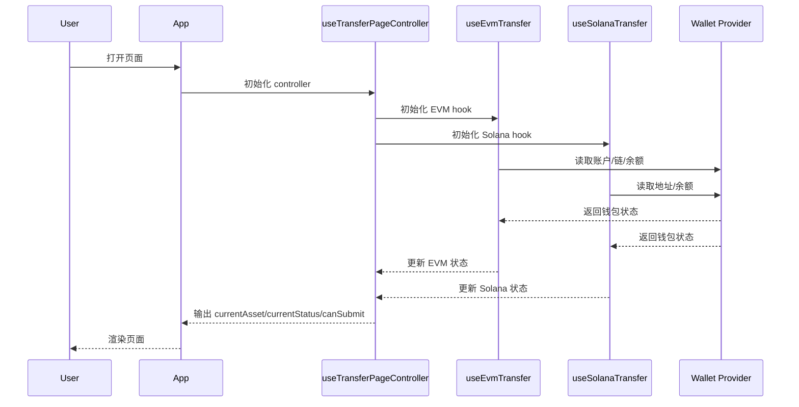
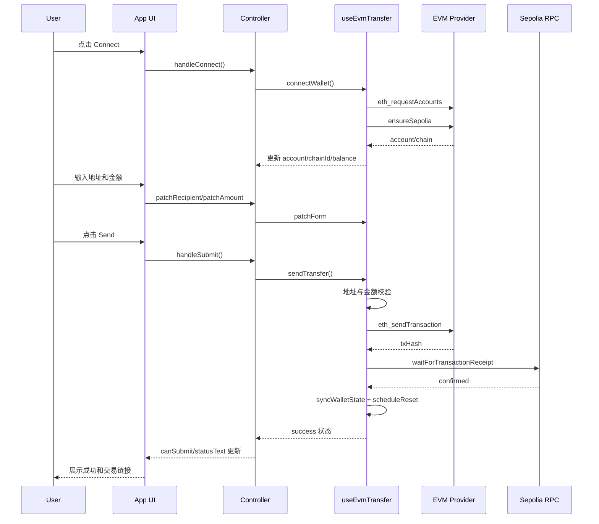
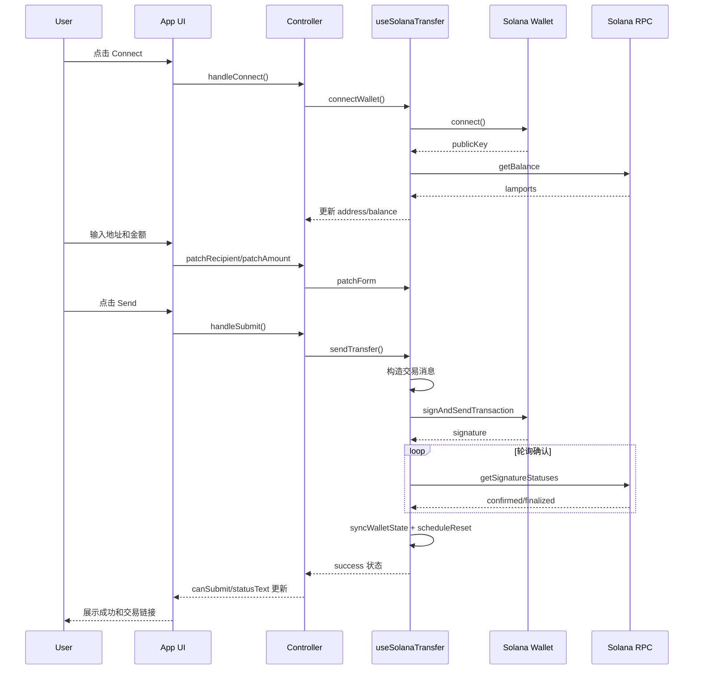

# Transfer 页面代码流转说明

本文用于快速讲解这个作业项目的代码执行路径，覆盖页面层、控制层、EVM/Solana 交易链路。

## 1. 分层结构

- 页面壳层：App 只负责组装组件和传参。
- 页面控制层：useTransferPageController 统一收敛当前资产、可提交状态、按钮动作。
- 链路层：
  - useEvmTransfer 负责 EVM 钱包连接、状态同步、ETH 发送。
  - useSolanaTransfer 负责 Solana 钱包连接、状态同步、SOL 发送。
- 基础层：lib 中 constants/providers/chains/utils 提供静态配置、钱包识别、链客户端和纯函数。

## 2. 总体时序（页面到链路）

1. App 挂载后调用 useTransferPageController。
2. 控制层同时初始化 EVM 与 Solana 两个 Hook。
3. 两个 Hook 内部 useEffect 启动：
   - 首次同步钱包状态。
   - 监听钱包事件（账户切换、网络切换、连接断开等）。
   - 通过定时轮询做兜底同步。
4. 页面组件只消费 controller 暴露的字段与动作，不直接访问链 SDK。

## 3. ETH 转账流（EVM 分支）

1. 用户点击 Connect：
   - controller 调用 evm.connectWallet。
   - hook 请求账户授权并确保链切到 Sepolia。
   - 成功后刷新账户与余额状态。
2. 用户输入地址与金额：
   - controller 的 patchRecipient / patchAmount 写入 evm.form。
3. 用户点击 Send：
   - controller 调用 evm.sendTransfer。
   - hook 进行前置校验（钱包、地址、金额）。
   - 触发 eth_sendTransaction。
   - 等待交易回执确认。
   - 成功后同步余额并延时清空表单。

## 4. SOL 转账流（Solana 分支）

1. 用户点击 Connect：
   - controller 调用 solana.connectWallet。
   - hook 请求钱包连接并刷新地址/余额。
2. 用户输入地址与金额：
   - controller 的 patchRecipient / patchAmount 写入 solana.form。
3. 用户点击 Send：
   - controller 调用 solana.sendTransfer。
   - hook 做前置校验（地址、金额、公钥）。
   - 构造交易消息并让钱包 signAndSendTransaction。
   - 轮询 getSignatureStatuses 等待 confirmed/finalized。
   - 成功后同步余额并延时清空表单。

## 5. 页面可提交状态计算

controller 会计算以下派生值：

- isValidAmount：金额是否为正数。
- willOverflow：输入金额是否超过当前余额。
- canSubmit：是否满足已连接、地址非空、金额有效、余额足够。
- statusText：底部摘要文案（如 Connect wallet first、Insufficient balance）。

## 6. 为什么这样拆

- 页面组件只关心展示，降低 JSX 与业务耦合。
- 控制层统一分发动作，避免在组件树里重复写 if asset === 'eth'。
- 链路 Hook 可单独测试与演进，后续接入更多链时成本更低。

## 7. Mermaid 时序图

### 7.1 页面初始化与状态同步

### 7.2 ETH 转账流程

### 7.3 SOL 转账流程

## 8. 讲解提纲（3 分钟版）

1. 先讲分层：App 只渲染，controller 做资产分发，EVM/Solana hook 专注链路。
2. 再讲初始化：页面一进来两个 hook 就同步钱包状态，事件监听和轮询双保险。
3. 然后讲 ETH：connect -> 校验 -> sendTransaction -> 等 receipt -> 刷新余额。
4. 再讲 SOL：connect -> 组交易 -> signAndSend -> 轮询 signature 状态。
5. 最后讲可提交逻辑：canSubmit 与 statusText 在 controller 统一计算，UI 只展示结果。
